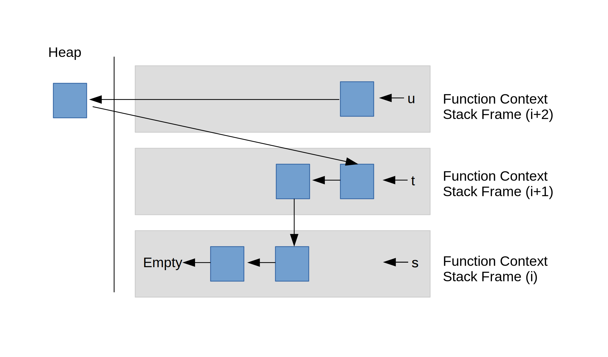
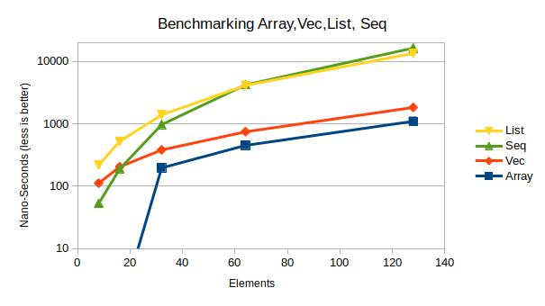

# seq module

The module _seq_ provides a generic sequence container _Seq_ for Rust.

_Seq_ is a lightweight container of data sequences (LIFO), managing dynamic list without
dynamic memory allocation involved. Sequences are stored in stack frames of function contexts.
Each element of a sequence has an individual lifetime `'a` managed by the Rust compiler.

## Usage

Put this in your Cargo.toml:
```toml
## Cargo.toml file
[dependencies]
seq = "0.3"
```
## Definition
_Seq_ is defined as generic enum. _Seq_ is a sequence of data of type T and the top most
element has lifetime 'a.

Either a sequence is  _Empty_ or a sequence is a construction of a new value
(head or first (ft)) on-top of another sequence (the tail or rest (rt)). The lifetime of the tail must be at least as
long as the one of the head. Two kind of constructions are possible, depending on location of tail in memory-heap or
on stack.
```rust
pub enum Seq<'a, T: 'a> {
   Empty,
   ConsRef(T, &'a Seq<'a, T>),
   ConsOwn(T, Box<Seq<'a, T>>),
}
```
Explaning the enum variants:
* `Empty`: The empty sequence `<>`
* `ConsRef(head, tail)`: Constructs a new sequence with `head` being the first element and `tail` referencing another,
  borrowed sequence. This variant permits construction of sequences using stack-allocated
  data solely.
* `ConsOwn(head, boxedtail)`: Constructs a new sequence with `head` being the first element and `boxedtail` referencing
  another, owned, boxed sequence. Here the tail is residing in heap allocated memory. This variant
  permits construction of sequences using heap-allocated dynamic data.

These variants may be combined with each other, representing a mixture of borrowed and owned elements. The memory
safety feature of Rust allows automated and correct management of lifetime of each element of the sequence.

The lifetime of each element of the sequence depends on the function-context it has been added to the top of the
sequence; _Empty_ is the element with longest lifetime (see image).

The following image illustrates the sequences `s`, `t`, `u`. The sequence `s` is a sub-sequence of `t`, and `t` 
being a sub-sequence of `u`; each one accessible in its function context only. 


For use-cases where a sub-routine/expression shall return a temporary extended sequence, it is possible to construct new 
sequences using elements in heap-memory. In this case these heap-elements are boxed/owned.


But, first and foremost, the container  _Seq_ is intended as lightweight, dynamic, stack-allocated, linked list for
use cases such as managing state/context while traversing tree-like data structures - without any dynamic
memory-allocation (heap) involved.

The sequence type `Seq` implements the trait `IntoIterator`, enabling the usage of Rust's iterator framework.

## Benchmarks
The data structure `Seq` implements a linked list. In terms of performance it cannot compete with a native
array. But, `Seq` ranks between the containers `Vec` and `LinkedList`.

The benchmark is a memory-intensive, recursive function call and benefits from consecutive memory;
each recursive function-call a new integer element is appended and an iterator is cumulating all elements.

As the benchmark-chart demonstrates, the container `Seq` performs better than `Vec` and`LinkedList` for up to
`N=16` elements; and even shows better performance than `LinkedList` if less than `N=64` elements. The benchmark
is performed for up to N= 8, 16, 32, 64, 128, 256, 512.

```> cargo bench --features benchmark```

```commandline
test benchmark::bench_array___8 ... bench:           0 ns/iter (+/- 0)
test benchmark::bench_array__16 ... bench:           0 ns/iter (+/- 0)
test benchmark::bench_array__32 ... bench:         196 ns/iter (+/- 9)
test benchmark::bench_array__64 ... bench:         450 ns/iter (+/- 29)
test benchmark::bench_array_128 ... bench:       1,109 ns/iter (+/- 98)
test benchmark::bench_array_256 ... bench:       3,125 ns/iter (+/- 50)
test benchmark::bench_array_512 ... bench:      12,053 ns/iter (+/- 230)
test benchmark::bench_list___8  ... bench:         215 ns/iter (+/- 4)
test benchmark::bench_list__16  ... bench:         527 ns/iter (+/- 10)
test benchmark::bench_list__32  ... bench:       1,408 ns/iter (+/- 461)
test benchmark::bench_list__64  ... bench:       4,209 ns/iter (+/- 86)
test benchmark::bench_list_128  ... bench:      13,638 ns/iter (+/- 884)
test benchmark::bench_list_256  ... bench:      52,786 ns/iter (+/- 4,552)
test benchmark::bench_list_512  ... bench:     188,453 ns/iter (+/- 3,053)
test benchmark::bench_seq___8   ... bench:          53 ns/iter (+/- 1)
test benchmark::bench_seq__16   ... bench:         191 ns/iter (+/- 10)
test benchmark::bench_seq__32   ... bench:       1,081 ns/iter (+/- 30)
test benchmark::bench_seq__64   ... bench:       4,432 ns/iter (+/- 82)
test benchmark::bench_seq_128   ... bench:      16,749 ns/iter (+/- 209)
test benchmark::bench_seq_256   ... bench:      63,775 ns/iter (+/- 528)
test benchmark::bench_seq_512   ... bench:     247,919 ns/iter (+/- 2,183)
test benchmark::bench_vec___8   ... bench:         111 ns/iter (+/- 3)
test benchmark::bench_vec__16   ... bench:         221 ns/iter (+/- 4)
test benchmark::bench_vec__32   ... bench:         398 ns/iter (+/- 11)
test benchmark::bench_vec__64   ... bench:         735 ns/iter (+/- 19)
test benchmark::bench_vec_128   ... bench:       1,634 ns/iter (+/- 49)
test benchmark::bench_vec_256   ... bench:       4,774 ns/iter (+/- 103)
test benchmark::bench_vec_512   ... bench:      15,306 ns/iter (+/- 250)
```



Every element of `Seq` is causing overhead of ca 16 bytes for the discriminator, and the reference
to the tail.

## Conclusion
These benchmarks show, the collection `Seq` shows better performance than `Vec` for 16 elements or less, and even
better performance than `LinkedList` for 64 elements or less. In this range `Seq` benefits from stack-memory.
When `N>64` performance drops, probably caused by page-faults and the need to request new memory-pages from OS.

## Examples

### Example: Stack-only Allocated
A stack allocated sequence is based on the variants Seq::Empty and Seq::ConsRef only. The following lines are creating 
a sequence`<>|1|2|3` in stack frame of function `myfun()`. The sequence is the input parameter to function `myfunNested()`
that is construction a new sequence `t`, adding two more elements to sequence `s`. The elements of `s` are a sub-sequence 
of `t`.
```rust
extern crate seq;
use seq::Seq;

fn myfun() {
   // constructing the sequence <>|1|2|3
   let s0: Seq<u32> = Seq::Empty();
   let s1: Seq<u32> = Seq::ConsRef(1, &s0);
   let s3: Seq<u32> = Seq::ConsRef(2, &s1);
   let s3: Seq<u32> = Seq::ConsRef(3, &s2);
   myfunNested(&s3);
   println!("head of sequence s3 is {:?}", &s3); // printing 3
}

fn myfunNested(s: &Seq<u32>)
{
    // extend the sequence to <>|1|2|3|4|5
   let t: Seq<u32> = Seq::ConsRef(4, s);
   let t: Seq<u32> = Seq::ConsRef(5, &t); // re-using the identifier `t`
   println!("head of sequence t is {:?}", &t); // printing 5
}
```

### Example: Stack-and-Heap Allocated
A sequence can be a mixture of stack-allocated and heap-allocated data elements. The following sequence
```rust
extern crate seq;
use seq::Seq;

fn myfun() {
   // constructing the sequence <>|0|1|2|3
   let s0: Seq<u32> = Seq::Empty();                        // stack
   let s1: Seq<u32> = Seq::ConsRef(0, &s0);                // stack
   let s2: Box<Seq<u32>> = Box::new(Seq::ConsRef(1, &s1)); // heap
   let s3: Box<Seq<u32>> = Box::new(Seq::ConsOwn(2, s2));  // heap
   let s4: Seq<u32> = Seq::ConsOwn(Data(3, s3));           // stack
   println!("seq {:?}", &s4);
}
```
### Example: Pattern Matching
Pattern-matching is used to de-construct a sequence.
```rust
extern crate seq;
use seq::Seq;

fn head(sequence: &Seq<u32>) -> Option<u32> {
   match sequence {
      &Seq::Empty => Option::None,
      &Seq::ConsRef(ref ft, ref rt) => Option::Some(*ft),
      &Seq::ConsOwn(ref ft, ref rt) => Option::Some(*ft)
   }
}
```
### Example: Dynamic sequence in nested/recursive function-calls
Sequences can be used to manage state in nested function calls. This code demonstrates how the iterator is used.
```rust
extern crate seq;
use seq::Seq;
use std::ops;

// Recursive, nested invocation while val<max. Each function-call adds a new seq-head and cumulates all values of the sequence (fold).
fn recurs(val: u32, max: u32, tail: &Seq<u32>) {
   if val < max {
      let sequence = Seq::ConsRef(val, tail);
      println!("sum is: {}", sequence.into_iter().fold(0, ops::Add::add));
      recurs(val + 1, max, &sequence);
   }
}

fn main() {
    recurs(0, 10, seq::empty());
}
```
### Example: Dynamic sequence in nested/recursive function-calls, combined with heap-alloc. data
'Seq' permits mixture of stack allocated data and heap allocated data within a single linked list.
The following code is a variation of previous sample, just adding two heap-allocated elements onto top
of sequence finally. This code demonstrates how the iterator is used.
```rust
extern crate seq;
use seq::Seq;
use std::ops;

fn prependTwoBoxedValues <'a> (v: u32, w: u32, seq: &'a Seq<u32> ) -> Box<Seq< 'a, u32>> {
   Box::new(Seq::ConsOwn(v +1,
      Box::new(Seq::ConsRef(w, seq))))
}

// Recursive, nested invocation while val<max. Each function-call sums up the sequence.
fn recurs(val: u32, max: u32, tail: &Seq<u32>) {
   if val < max {
      let sequence = Seq::ConsRef(val, tail);
      println!("sum is: {}", sequence.into_iter().fold(0, ops::Add::add));
      recurs(val + 1, max, &sequence);
   } else {
      let sequence: Box<Seq<u32>> = prependTwoBoxedValues(max+1, max, tail);
      println!("sum is: {}", sequence.into_iter().fold(0, ops::Add::add));
   }
}

fn main() {
   recurs(0, 10, seq::empty());
}
```
## Macros
The `seqdef!` macro defines a stack-allocated sequence variable using the speficied data list,
the last data item in the list will be the top most in the sequence (head). The macro can be used to
create a new sequence on top of another one (tail).

### Macro 1: Creating a seq variable `s`, the head will be `2`.
Is constructing a sequence s := <>|0|1|2; 
```rust
seqdef!(s; seq::empty() => 0, 1, 2);
```

### Macro 2: Creating a seq variable t without explicit `seq::empty()`. Seq `t` is identical to `s`.
Is constructing a sequence t := <>|0|1|2; 
```rust
seqdef!(t; 0, 1, 2);
```

### Macro 3: Creating a seq variable u, using Seq `s` of example 1 as tail, the head will be `5`.
On top of sequence s, constructing a sequence u := &s|3|4|5, the effictive sequence is u := <>|0|1|2|3|4|5; 
```rust
seqdef!(u; &s => 3, 4, 5);
```

### Macro 4: Creating a dynamic seq with MAX elements within stack frame, reading values from iterator
The previous macros are useful, but limited as the exact number of elements must be known at compile time. 
The previous macros are not able to deal with dynamic number of elements between 1-MAX, where MAX might be a large
value.

The  following macro `seqdef_try!` simplifies handling of dynamic number of values when constructing a sequence.
This macro reserves MAX elements on the stack
every time when entering the function context. The upper limit MAX is defined at compile time. 
At runtime the  sequence is constructed, reading the elements from the iterator and placing them
in the reserved stack-memory. When the function context is left, the stack-memory is released.
The macro seqdef_try! will declare the specified identifier as type Result<Seq<T>>. 
Rolling out the values from iterator into the reserved stack may fail if the iterator is empty, 
or if the amount exceeds MAX. The value of `x` must be checked after construction with `seqdef_try!`.

Note! No matter the number of elements returned by the iterator, the macro is always reserving 
stack-memory for MAX elements. If you choose too large, the stack might run out of memory.
The iterator provided to the macro may consume the underlying container-elements or clone each element.
```rust
  use std::mem;
  use std::ptr;
  
  fn dynamic_seq_rollout_on_stack() {
      const MAX: usize = 10;
      let large_list: &[i32] = &[42; MAX];
      
      // define x of type Result<Seq<i32>>, read all elements from array and place them on stack as sequence
      seqdef_try!(x, i32, MAX; empty() => large_list.iter());
      
      // handling the result, Ok or Error
      match &x {
          &Ok(ref sequence) => println!("large sum {}", (&*sequence).into_iter().fold(0i32, ops::Add::add)),
          &Err(reason) => println!("roll out failed due to {}", reason)
      }
  }
```
