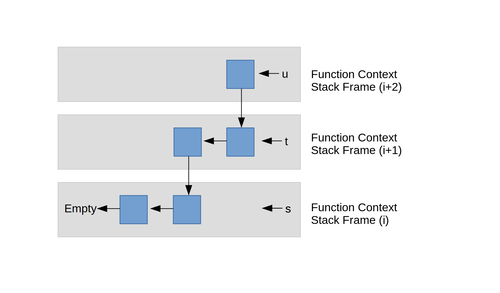

# seq module

The module _seq_ provides a generic sequence container _Seq_ for Rust.

_Seq_ is a lightweight container of data sequences, data being stacked on top of each other (LIFO).

Add the following dependency to your Cargo.toml file:
```toml
## Cargo.toml file
[dependencies]
seq = "0.2.0"
```
## Definition
_Seq_ is defined as generic enum. _Seq_ is a sequence of data of type T and lifetime 'a.

Either a sequence is  _Empty_ or a sequence is a construction of a new value
(head or first (ft)) on-top of another sequence (the tail or rest (rt)). The lifetime of the tail must be at least as
long as the one of the head. Two kind of constructions are possible, depending on location of tail in memory-heap or
on stack.
```rust
pub enum Seq<'a, T: 'a> {
   Empty,
   ConsRef(T, &'a Seq<'a, T>),
   ConsOwn(T, Box<Seq<'a, T>>),
}
```
Explaning the enum variants:
* `Empty`: The empty sequence `<>`
* `ConsRef(head, tail)`: Constructs a new sequence with `head` being the first element and `tail` referencing another,
  borrowed sequence. This variant permits construction of sequences using stack-allocated
  data solely.
* `ConsOwn(head, boxedtail)`: Constructs a new sequence with `head` being the first element and `boxedtail` referencing
  another, owned, boxed sequence. Here the tail is residing in heap allocated memory. This variant
  permits construction of sequences using heap-allocated dynamic data.

These variants may be combined with each other, representing a mixture of borrowed and owned elements. The memory
safety feature of Rust allows automated and correct management of lifetime of each element of the sequence.

The lifetime of each element of the sequence depends on the function-context it has been added to the top of the
sequence; _Empty_ is the element with longest lifetime (see image).

The following image illustrates the sequences `s`, `t`, `u`. The sequence `s` is a sub-sequence of `t`, and `t` 
being a sub-sequence of `u`; each one accessible in its function context only. 


For use-cases where a sub-routine/expression shall return a temporary extended sequence, it is possible to construct new 
sequences using elements in heap-memory. In this case these heap-elements are boxed/owned.


But, first and foremost, the container  _Seq_ is intended as lightweight, dynamic, stack-allocated, linked list for
use cases such as managing state/context while traversing tree-like data structures - without any dynamic
memory-allocation (heap) involved.

The sequence type `Seq` implements the trait `IntoIterator`, enabling the usage of Rust's iterator framework.

## Example: Stack-only Allocated
A stack allocated sequnece is based on the variants Seq::Empty and Seq::ConsRef only
```rust
extern crate seq;
use seq::Seq;

fn myfun() {
   // constructing the sequence seq!(3,2,1)
   let s0: Seq<u32> = Seq::Empty();
   let s1: Seq<u32> = Seq::ConsRef(1, &s0);
   let s3: Seq<u32> = Seq::ConsRef(2, &s1);
   let s3: Seq<u32> = Seq::ConsRef(3, &s2);
   println!("seq {:?}", &s3);
}
```

## Example: Stack-and-Heap Allocated
A sequence can be a mixture of stack-allocated and heap-allocated data elements. The following sequence
```rust
extern crate seq;
use seq::Seq;

fn myfun() {
   let s0: Seq<u32> = Seq::Empty();                        // stack
   let s1: Seq<u32> = Seq::ConsRef(0, &s0);                // stack
   let s2: Box<Seq<u32>> = Box::new(Seq::ConsRef(1, &s1)); // heap
   let s3: Box<Seq<u32>> = Box::new(Seq::ConsOwn(2, s2));  // heap
   let s4: Seq<u32> = Seq::ConsOwn(Data(3, s3));           // stack
   println!("seq {:?}", &s4);
}
```
## Example: Pattern Matching
Pattern-matching is used to de-construct a sequence.
```rust
extern crate seq;
use seq::Seq;

fn head(sequence: &Seq<u32>) -> Option<u32> {
   match sequence {
      &Seq::Empty => Option::None,
      &Seq::ConsRef(ref ft, ref rt) => Option::Some(*ft),
      &Seq::ConsOwn(ref ft, ref rt) => Option::Some(*ft)
   }
}
```
## Example: Dynamic sequence in nested/recurs function-calls
Sequences can be used to manage state in nested function calls. This code demonstrates how the iterator is used.
```rust
extern crate seq;
use seq::Seq;
use std::ops;

// Recursive, nested invocation while val<max. Each function-call sums up the sequence.
fn recurs(val: u32, max: u32, tail: &Seq<u32>) {
   if val < max {
      let sequence = Seq::ConsRef(val, tail);
      println!("sum is: {}", sequence.into_iter().fold(0, ops::Add::add));
      recurs(val + 1, max, &sequence);
   }
}

fn main() {
    recurs(0, 10, seq::empty());
}
```
## Example: Dynamic sequence in nested/recurs function-calls, combined with heap-alloc. data
'Seq' permits mixture of stack allocated data and heap allocated data within a single linked list.
The following code is a variation of previous sample, just adding two heap-allocated elements onto top
of sequence finally. This code demonstrates how the iterator is used.
```rust
extern crate seq;
use seq::Seq;
use std::ops;

fn prependTwoBoxedValues <'a> (v: u32, w: u32, seq: &'a Seq<u32> ) -> Box<Seq< 'a, u32>> {
   Box::new(Seq::ConsOwn(v +1,
      Box::new(Seq::ConsRef(w, seq))))
}

// Recursive, nested invocation while val<max. Each function-call sums up the sequence.
fn recurs(val: u32, max: u32, tail: &Seq<u32>) {
   if val < max {
      let sequence = Seq::ConsRef(val, tail);
      println!("sum is: {}", sequence.into_iter().fold(0, ops::Add::add));
      recurs(val + 1, max, &sequence);
   } else {
      let sequence: Box<Seq<u32>> = prependTwoBoxedValues(max+1, max, tail);
      println!("sum is: {}", sequence.into_iter().fold(0, ops::Add::add));
   }
}

fn main() {
   recurs(0, 10, seq::empty());
}
```
## Example: Demonstrating the macro seqdef!
The `seqdef!` macro defines a stack-allocated sequence variable using the speficied data list,
the last data item in the list will be the top most in the sequence (head). The macro can be used to
create a new sequence on top of another one (tail).

Example 1) Creating a seq variable `s`, the head will be `2`.
```
seqdef!(s; seq::empty() => 0, 1, 2);
```

Example 2) Creating a seq variable t without explicit `seq::empty()`. Seq `t` is identical to `s`.
```
seqdef!(t; 0, 1, 2);
```

Example 3) Creating a seq variable u, using Seq `s` of example 1 as tail, the head will be `5`.
```
seqdef!(u; &s => 3, 4, 5);
```